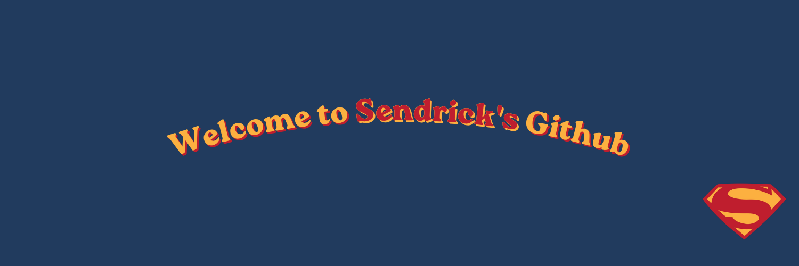
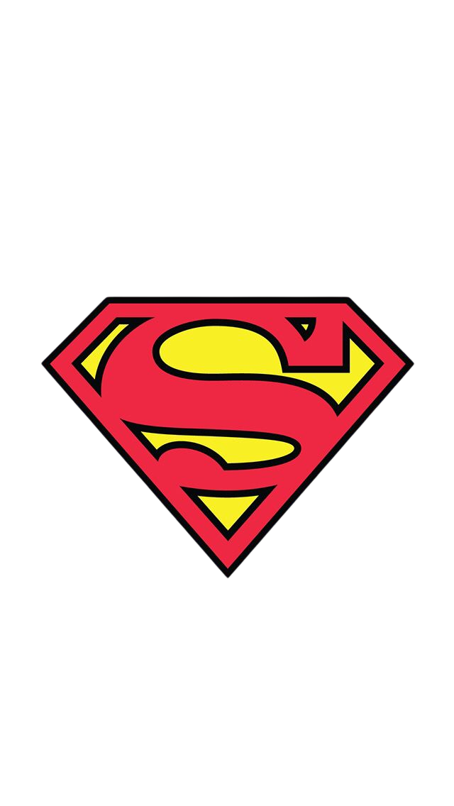
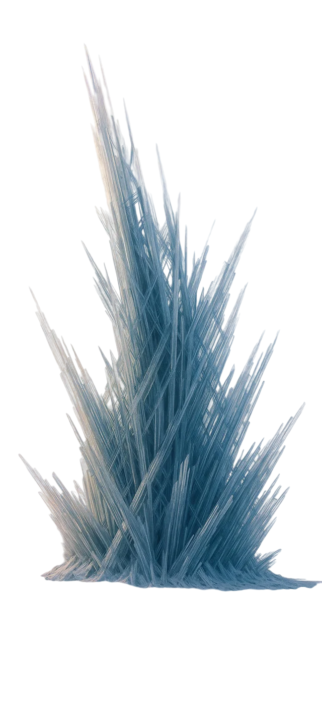
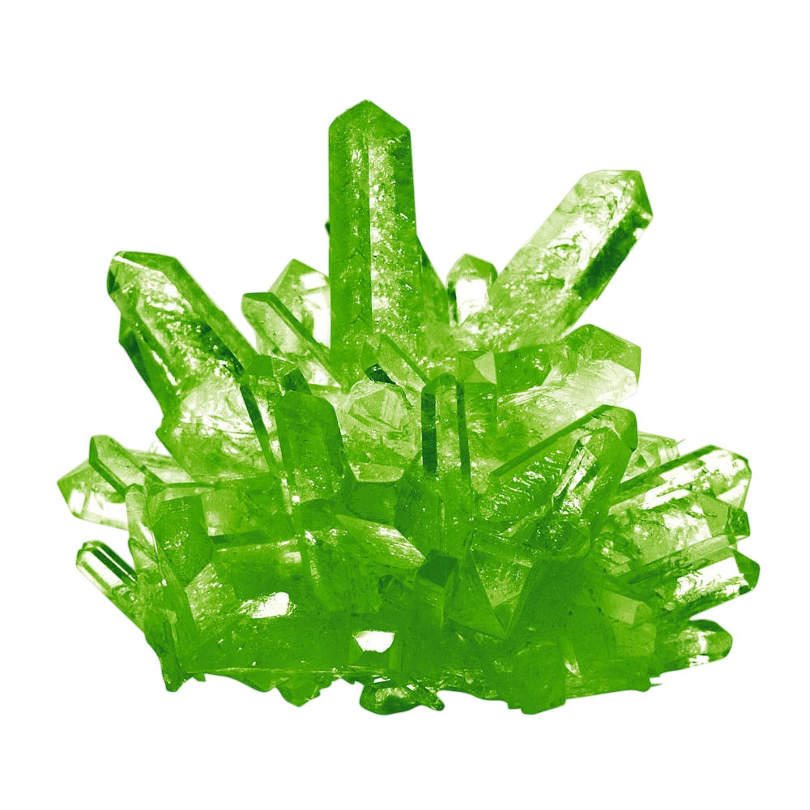
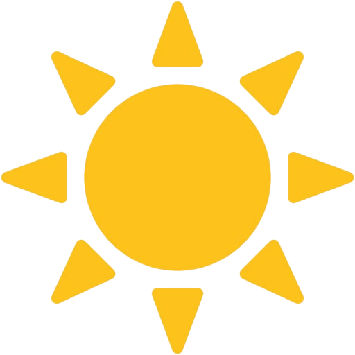

 

  
  
  

 

  
  
   
  
  
Architecting solid, scalable, and high-performance applications.

  
   
  
  

    
    
    
    
  

 
 

<h2 align="center"> <em style="color: #fcb040;">About Me</em></h2>

 

<table align="center" style="border: none;">
  <tr>
    <td width="65%" style="border: none; vertical-align: middle; padding-right: 20px;">
      
Hello! I'm <strong style="color: #bf1e2e;">Sendrick Paz</strong>, a software developer from Minas Gerais driven by a deep passion for technology and continuous learning. I treat software engineering not just as a study path, but as a craft. I thrive on the challenge of taking ideas from scratch and architecting them into solid, scalable, and high-performance applications.
 
      
Currently pursuing my degree in <b style="color: #fcb040;">Systems Analysis and Development at PUC Minas</b>, I pour my dedication into writing clean, maintainable code. Whether I am structuring a resilient backend API or designing a seamless cross-platform mobile experience, my goal is always to deliver value and solve real-world problems efficiently.
 
      
 <b>Current Focus:</b> Advancing my expertise in <code style="color: #213b5e; background-color: #fcb040; padding: 2px 4px; border-radius: 4px;">Java & Spring Boot</code> for backend systems.

      
 <b>Ambition:</b> To become a technical reference in my field and build a solid international career. Ultimately, the goal is simple: write world-class code.

    </td>
    <td width="35%" align="center" style="border: none; vertical-align: middle;">
      
    </td>
  </tr>
</table>

 
 

<h2 align="center"> <em style="color: #fcb040;">Classified Projects</em></h2>

 

  <i> [ ARCHIVES PENDING DECLASSIFICATION ]</i> 
  <i>⚠️ Currently restructuring the active repositories. New blueprints will be uploaded shortly.</i>

<!-- ESPAÇO RESERVADO PARA OS PROJETOS FUTUROS -->
<table align="center" style="border: none;">
  <tr>
  </tr>
</table>

 
 

<h2 align="center"> <em style="color: #fcb040;">Tech Arsenal</em></h2>

  <b>Backend Infrastructure:</b> 
  
  

  <b>Frontend & Mobile Ecosystem:</b> 
  
  
  
  

  <b>Data & Version Control:</b> 
  
  
  

 

<h2 align="center"> <em style="color: #fcb040;">Telemetry Data</em></h2>

  
  

  

  

