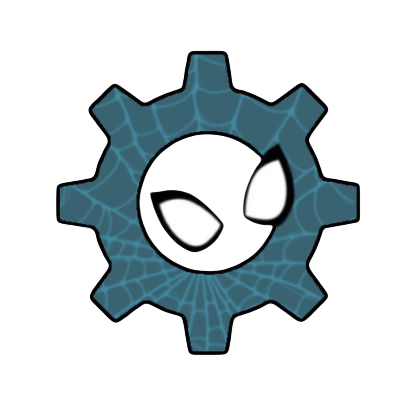

<!-- BANNER -->

 

<!-- REDES SOCIAIS -->

  
  

 

<!-- ABOUT ME -->
<h2 align="center">  <em>About me</em> </h2>

 

  Hello There! <em><b>I'm Sendrick Paz</b></em>, a 21-year-old student. I enjoy learning new technologies and building solid application architectures from scratch. Now I'm focusing my studies on backend and mobile development to put into practice my knowledge about APIs and interactive interfaces.

 

<!-- LISTA COM ÍCONES CUSTOMIZADOS -->

   <em><b>🕸️Studying Systems Analysis and Development at PUC Minas</b></em>  
   <em><b>🕷️Main focus on Java, Spring Boot, TypeScript, and React Native / Expo</b></em>  
   <em><b>🕸️Developed two mobile applications utilizing the React Native ecosystem</b></em>  

 
 

<!-- TECHNOLOGIES -->
<h2 align="center">  <em>Technologies</em> </h2>

  
  
  
  
  
  
  

 

<!-- STATISTICS -->
<h2 align="center">  <em>Statistics</em> </h2>

  
  

  

