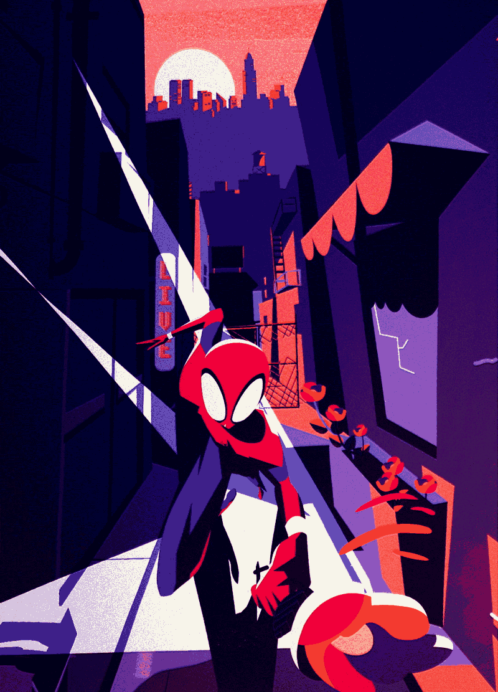
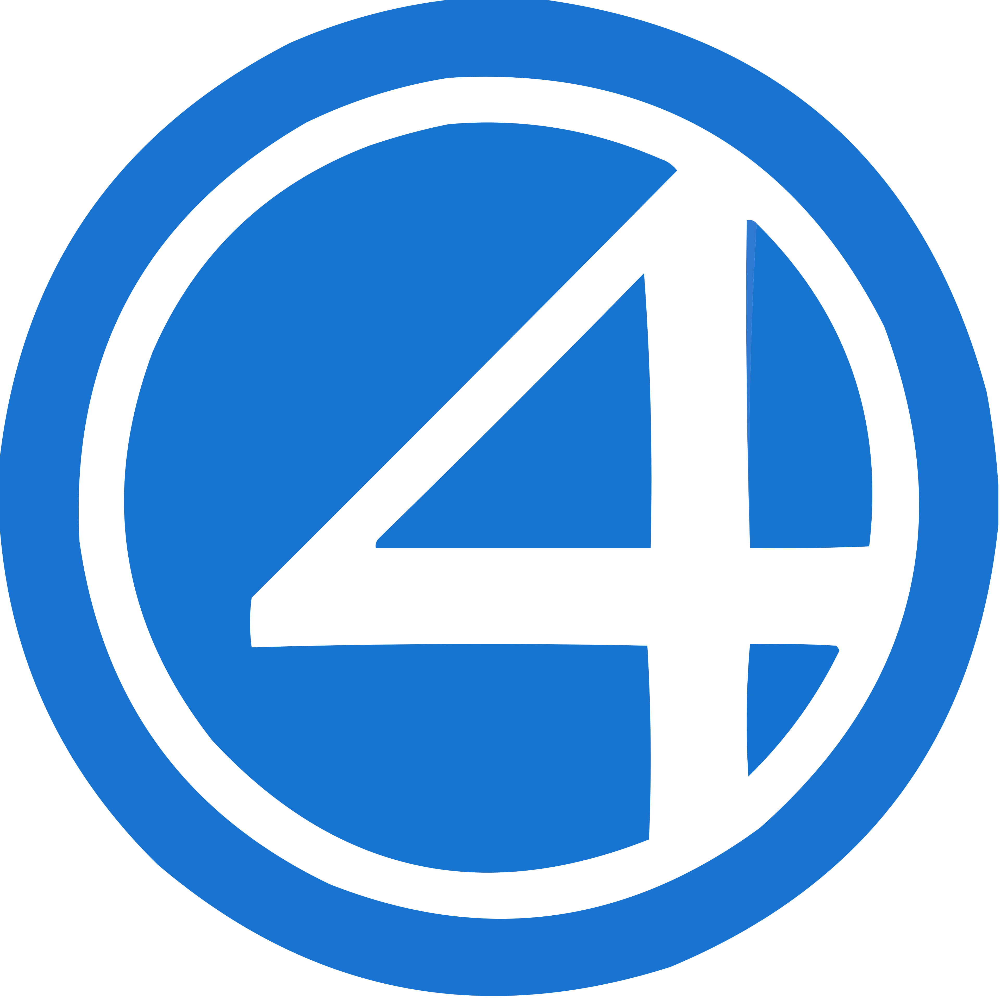
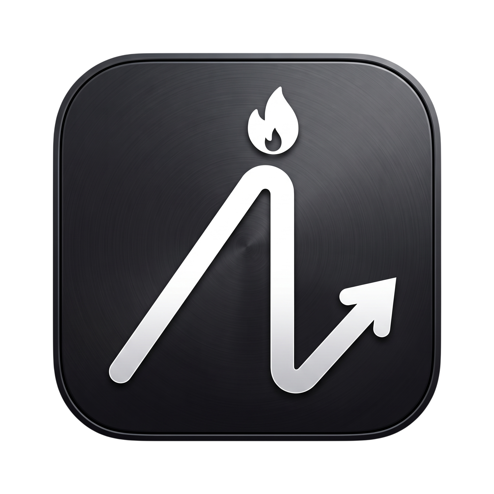

<!-- BANNER -->

 

<!-- REDES SOCIAIS E PORTFÓLIO -->

  
  
  

 

<!-- QUICK SUMMARY / TL;DR -->

  
  
   
  
  
Focused on building robust scalable architectures, responsive web solutions, and cross-platform applications.

  
   
  
  

    
    
    
    
  

 
 

<!-- ABOUT ME -->
<h2 align="center">  <em style="color: #E23636;">About me</em> </h2>

 

<!-- Estrutura de tabela -->
<table align="center" style="border: none;">
  <tr>
    <td width="65%" style="border: none; vertical-align: middle; padding-right: 20px;">
      
Hello! I'm <strong style="color: #E23636;">Sendrick Paz</strong>, a software developer from Minas Gerais driven by a deep passion for technology and continuous learning. I treat software engineering not just as a study path, but as a craft. I thrive on the challenge of taking ideas from scratch and architecting them into solid, scalable, and high-performance applications.
 
      
Currently pursuing my degree in <b>Systems Analysis and Development at PUC Minas</b>, I pour my dedication into writing clean, maintainable code. Whether I am structuring a resilient backend API or designing a seamless cross-platform mobile experience, my goal is always to deliver value and solve real-world problems efficiently.
 
      
🕸️ <b>Current Focus:</b> Advancing my expertise in <code>Java & Spring Boot</code> for backend systems, and <code>TypeScript & React Native</code> for mobile ecosystems.
 
      
🕷️ <b>Ambition:</b> To become a technical reference in my field and build a solid international career. Ultimately, the goal is simple: write world-class code, conquer the tech world, and achieve all shared professional goals alongside my favorite coding partner .

    </td>
    <td width="35%" align="center" style="border: none; vertical-align: middle;">
      
    </td>
  </tr>
</table>

 
 

<!-- PROJECTS -->
<h2 align="center">  <em style="color: #173679;">Projects</em> </h2>

 

<!-- SEÇÃO 1: BACKEND -->
<h3 align="center">⚙️ Backend & API Development</h3>

<table align="center" style="border: none;">
  <tr>
    <td width="50%" align="center" style="border: none;">
       
      <b>🏎️ Tuning Shop API</b>  
      
A RESTful API to manage performance car catalogs and modifications. Features complex <code>@ManyToMany</code> relationships, dynamic HP calculation, and strict business rules preventing duplicate part installations.

      
      
        
      <a href="https://github.com/kksensen/tuning-shop-api">🕷️ Repository</a>
    </td>
    <td width="50%" align="center" style="border: none;">
       
      <b>🏁 F1 Telemetry & Stats API</b>  
      
Data-driven API for historical Formula 1 metrics and race stats. Built for optimizing reads with complex <code>JPQL</code>/Native queries, data aggregation, pagination, and advanced nested JSON structuring.

      
      
        
      <a href="#">🕷️ Repository [WIP]</a>
    </td>
  </tr>
  <tr>
    <td width="50%" align="center" style="border: none;">
       
      <b>💳 Payment Gateway API</b>  
      
High-availability payment processing simulator. Ensures transactional integrity with ACID compliance (<code>@Transactional</code>), DTO patterns, strict balance validations, and global exception handling.

      
      
        
      <a href="#">🕷️ Repository [WIP]</a>
    </td>
    <td width="50%" align="center" style="border: none;">
       
      <b>📈 Stock Market Simulator</b>  
      
Real-time trading engine for order matching. Highly focused on Java concurrency control (Locks), transaction isolation, dynamic price state updates, and complex rule engines to handle processing bottlenecks.

      
      
        
      <a href="#">🕷️ Repository [WIP]</a>
    </td>
  </tr>
</table>

 

<!-- SEÇÃO 2: MOBILE & FULLSTACK -->
<h3 align="center">📱 Mobile & Fullstack Ecosystem</h3>

<table align="center" style="border: none;">
  <tr>
    <td width="50%" align="center" style="border: none;">
       
      <b> Apex Routine</b>  
      
A mobile app designed to build consistent daily habits through gamification and absolute focus on a single main task.

      
      
      
        
      <a href="https://github.com/kksensen/apex-routine-showcase">🕷️ Repository [showcase]</a>
    </td>
    <td width="50%" align="center" style="border: none;">
       
      <b> RoyalCare</b>  
      
An offline-first medication management system with predictive stock control and automated daily PDF reporting.

      
      
      
        
      <a href="https://github.com/kksensen/royalcare-showcase">🕷️ Repository [showcase]</a>
    </td>
  </tr>
  <tr>
    <td width="50%" align="center" style="border: none;">
       
      <b>👑 Crownly</b>  
      
A real-time communication hub featuring low-latency WebSocket text chat and WebRTC P2P voice calls, wrapped in a dynamic UI.

      
      
      
        
      <a href="https://github.com/kksensen/crownly-app-showcase">🕷️ Repository [showcase]</a>
    </td>
    <td width="50%" align="center" style="border: none;">
       
      <b>🌐 [Web Project Title 2]</b>  
      
An interactive web interface designed with clean architecture and typed components.

      
        
      <a href="#">🕷️ Repository</a> &nbsp; | &nbsp; <a href="#">🕸️ Live Demo</a>
    </td>
  </tr>
</table>

 
 

<!-- TECHNOLOGIES -->
<h2 align="center">  <em style="color: #E23636;">Technologies</em> </h2>

  <b>Backend:</b> 
  
  

  <b>Mobile & Frontend:</b> 
  
  
  
  

  <b>Database & Tools:</b> 
  
  
  

 

<!-- STATISTICS -->
<h2 align="center">  <em style="color: #173679;">Statistics</em> </h2>

<!-- GitHub Stats & Streak (Lado a Lado) -->

  
  

<!-- Top Languages (Embaixo) -->

  

<!-- Activity Graph -->

  

